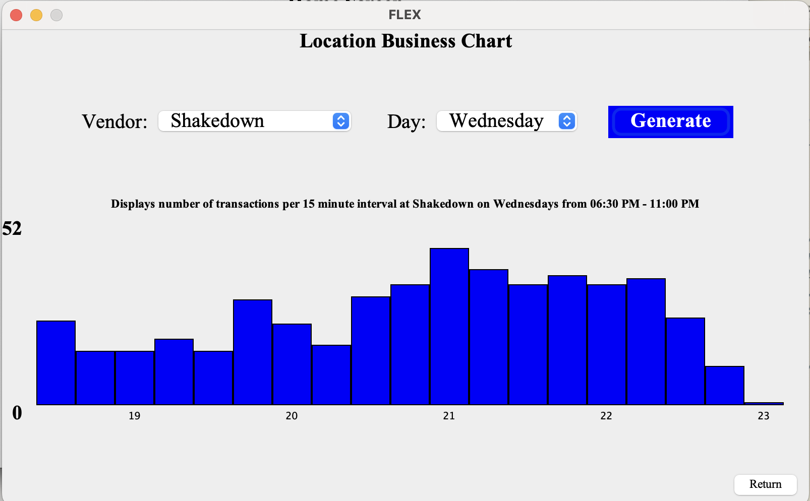
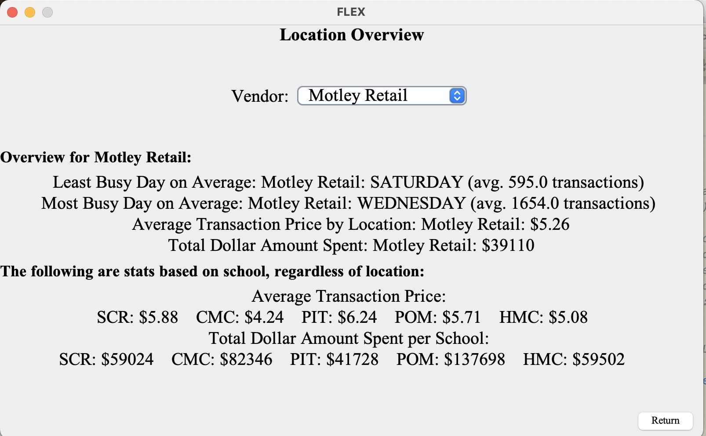
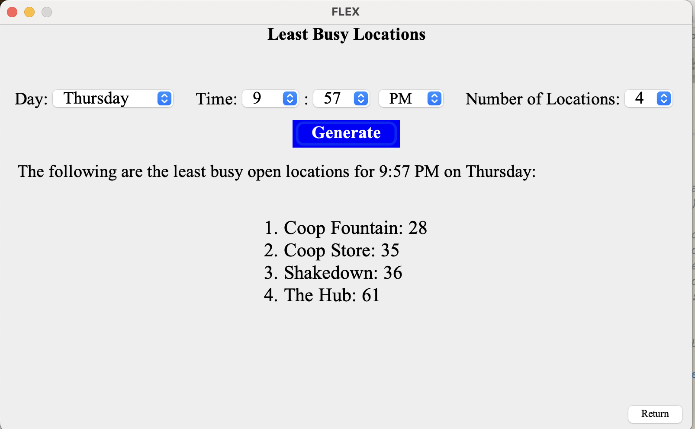

# CS062-Final-Project-Flex-Analysis-

This software is intended to be used to explore activity trends at on-campus dining and grab and go snack options at the Claremont Colleges, based on flex transaction data. Through a Graphical User Interface, a user will be able to access three features that can help them determine where the best location is to get a meal on a given day or time. 

The first feature, Chart, allows users to select a vendor and day of the week and a histogram with the number of transactions per 15 minute interval on that day populates when the "Generate" button is clicked:



Note that if no new chart is generated for a particular selection, this means that the selected vendor is closed for the entirety of the selected day.

The second feature, Overview, allows users to select a food vendor and access a summary which includes the least busy day on average,
most busy day on average, average transaction price, total retail over 6 weeks, as well as the average transaction price and total dollar
amount spent per school:



Finally, the third feature, Least Busy, allows users to choose a specific day and time (with a default of the current time), and generates the selected number of least busy locations in the time interval of the given time on the given day:



## Running the Code
In order to interact with the features of the project, users should run the TestFlex class, which contains the main method. This will initiate the GUI, which can be navigated using labeled buttons for the features.

## API Instructions

This project exposes two types of functionality:

User Interface (UI) — launched through the TestFlex main class.

Core Logic Methods — defined in auxiliary classes and callable independently of the UI.

Below is a full description of constructors, public methods, and usage examples for each component.

### 1. UI Entry Point

**Class: `TestFlex`** 

The `TestFlex` class reads in the data, and invokes the UI for interacting with the system. It does not implement the program's primary operations, but invokes the underlying methods defined in other classes.

**Constructor** <br>
`public static void main(String[] args)`  <br>
Initializes a new Flex object, reads in the flex data, and invokes the user interface. Entry point if you want to start the visual interface. The Chart feature requires the user interface to display the histogram.

To run:
```java 
javac *.java
java TestFlex
```

### 2. Core Logic Methods

### **Class: `Overview`** 
Computes overview summary feature, including the least busy day on average,
most busy day on average, average transaction price, total retail over 6 weeks, as well as the average transaction price and total dollar
amount spent per school.

**Constructor** <br>
`public Overview (TimeData td, FrequencyData fd)` <br>
Assigns TimeData and FrequencyData data structures belonging to a Flex object to be used to calculate overview.

Example usage:
```java
Flex flex = new Flex();
flex.loadCSV("Data/Stored_Value_Transaction_by_Customer__11_39_2025-10-17_11_40_52(Stored_Value_Transaction_by_Cus).csv");
Overview o = new Overview(flex.getTimeData(), flex.getFreqData());
```

**Method 1**
#### **`public String getLeastBusy()`**  
**Description:**  
Computes the average number of transactions per weekday for each location and returns, for every location, the **least busy day** (lowest average transactions).

**Inputs:**  
- none  

**Output:**  
- `String` summarizing each location’s least busy weekday and the corresponding average transaction count

**Example usage:**  
```java
o.getLeastBusy();
```
**Example output** <br>
Least Busy Day on Average: <br>
Motley Retail: SATURDAY (avg. 595.0 transactions) <br>
Shakedown: SATURDAY (avg. 278.0 transactions) <br>
The Hub: SATURDAY (avg. 2495.0 transactions) <br>
Cafe 47: MONDAY (avg. 934.0 transactions) <br>
Grove House: TUESDAY (avg. 24.0 transactions) <br>
HMC - Jays Place: MONDAY (avg. 1014.0 transactions) <br>
Science Center: SATURDAY (avg. 262.0 transactions) <br>
The Cafe (Mudd): FRIDAY (avg. 1033.0 transactions) <br>
Coop Store: SUNDAY (avg. 1096.0 transactions) <br>
Coop Fountain: FRIDAY (avg. 382.0 transactions)


**Method 2**
#### **`public String getMostBusy()`**  
**Description:**  
Computes the average transactions per weekday for each location and returns each location’s most busy day (highest average transactions).

**Inputs:**  
- none  

**Output:**  
- `String` summarizing each location’s most busy weekday and the corresponding average transaction count

**Example usage:**  
```java
o.getMostBusy();
```
**Example output** <br>
Most Busy Day on Average: <br>
Motley Retail: WEDNESDAY (avg. 1654.0 transactions) <br>
Shakedown: WEDNESDAY (avg. 567.0 transactions) <br>
The Hub: WEDNESDAY (avg. 3498.0 transactions) <br>
Cafe 47: WEDNESDAY (avg. 1232.0 transactions) <br>
Grove House: WEDNESDAY (avg. 110.0 transactions) <br>
HMC - Jays Place: SATURDAY (avg. 1976.0 transactions) <br>
Science Center: WEDNESDAY (avg. 787.0 transactions) <br>
The Cafe (Mudd): WEDNESDAY (avg. 1633.0 transactions) <br>
Coop Store: WEDNESDAY (avg. 2850.0 transactions) <br>
Coop Fountain: WEDNESDAY (avg. 710.0 transactions) <br>


**Method 3**
#### **`public String getTransactionAmountbySchool()`**  
**Description:**  
Calculates, across all locations, the average dollar amount per transaction for each school and returns.

**Inputs:**  
- none  

**Output:**  
- `String` listing each school and its average transaction value (rounded to two decimals)

**Example usage:**  
```java
o.getTransactionAmountbySchool();
```
**Example output**<br>
Average Transaction Price: <br>
SCR: $5.88    CMC: $4.24    PIT: $6.24    POM: $5.71    HMC: $5.08    


**Method 4**
#### **`public String getTransactionAmountbyLocation()`**  
**Description:**  
Computes the average transaction amount at each location, summing all schools’ spending at that location and dividing by total transaction count and returns.

**Inputs:**  
- none  

**Output:**  
- `String` showing each location and its average transaction price

**Example usage:**  
```java
o.getTransactionAmountbyLocation();
```
**Example output**<br>
Average Transaction Price by Location: <br>
Motley Retail: $5.26 <br>
Shakedown: $4.64 <br>
The Hub: $4.9<br>
Cafe 47: $5.79<br>
Science Center: $5.12<br>
HMC - Jays Place: $6.58<br>
Grove House: $7.25<br>
The Cafe (Mudd): $4.69<br>
Coop Store: $4.62<br>
Coop Fountain: $8.03<br>

**Method 5**
#### **`public String getTotalAmountbySchool()`**  
**Description:**  
Calculates the total dollar amount spent over the entire semester by each school, aggregated across all locations.

**Inputs:**  
- none  

**Output:**  
- `String` listing each school and the total amount spent

**Example usage:**  
```java
o.getTotalAmountbySchool();
```
**Example output**<br>
Total Dollar Amount Spent per School: <br>
SCR: $59024    CMC: $82346    PIT: $41728    POM: $137698    HMC: $59502 


**Method 6**
#### **`public String getTotalAmountbyLocation()`**  
**Description:**  
Calculates the total dollar amount spent over the entire semester at each location, aggregated across all schools.

**Inputs:**  
- none  

**Output:**  
- `String` listing each location and the total amount spent

**Example usage:**  
```java
o.getTotalAmountbyLocation();
```
**Example output**<br>
Total Dollar Amount Spent: <br>
Motley Retail: $39110<br>
Shakedown: $8413<br>
The Hub: $100636<br>
Cafe 47: $31545<br>
Science Center: $19773<br>
HMC - Jays Place: $61938<br>
Grove House: $2154<br>
The Cafe (Mudd): $31315<br>
Coop Store: $64349<br>
Coop Fountain: $21200


### **Class: `LeastBusySpots`** 
Completes Least Busy feature, by providing the given number of locations likely to be the least busy at the given day and time.

#### `public static String findLeastBusy(TimeData t, LocationHours locationHours, String inputDay, String inputHour, String inputMinute, int inputLimit)`

**Description:**  
 Prints the least busy locations based on given day, time, and number of locations

**Inputs:**  
- `TimeData t` time data passed from main method
- `LocationHours locationHours` hours of each location
- `String inputDay` day to determine least busy location
- `String inputHour` hour to determine least busy location
- `String inputMunite` minute to determine least busy location
- `int inputLimit` number of least busy locations to return

**Output:**  
- `String` containing the `inputLimit` least busy spots at the given day and time

**Example usage:**  
```java
System.out.println(LeastBusySpots.findLeastBusy(flex.getTimeData(), flex.getLocationHours(), "Sunday","18","35", 4));
```
**Example output**<br>
1. Motley Retail: 1 <br>
2. Coop Store: 17 <br>
3. Shakedown: 25 <br>
4. The Hub: 47 <br>


## Acknowledgments
This project was created by Jalen DeLoney, Paityn Richardson, Maren Rusk, and Nate Wehner for CSCI062 at Pomona College.  
Special thanks to the Professor Jingyi Li for guidance.